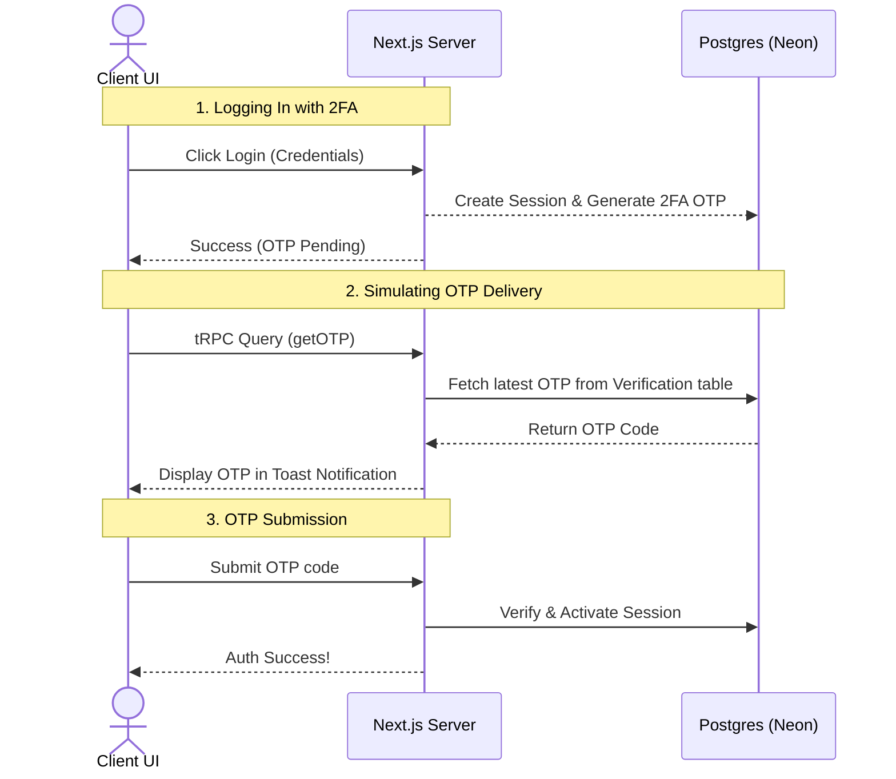

# ⚡ T3 Stack & Better Auth Sandbox

A high-performance, fully type-safe interactive authentication sandbox built using the **T3 Stack** (Next.js, Prisma, tRPC) and powered by **Better Auth**. 

This project was developed as a hands-on learning environment to master secure authentication patterns, custom middleware hooks, and complex database interactions without needing third-party email/SMS gateways.

---

## 🚀 Core Tech Stack

- **Framework**: [Next.js 16](https://nextjs.org/) (App Router, React 19)
- **API Layer**: [tRPC v11](https://trpc.io/) & [TanStack Query v5](https://tanstack.com/query) for end-to-end type safety.
- **Database & ORM**: [Prisma ORM](https://www.prisma.io/) with [PostgreSQL](https://neon.tech/) (hosted on Neon).
- **Authentication**: [Better Auth](https://www.better-auth.com/) (Version 1.6+) utilizing the Prisma database adapter.
- **Styling**: [Tailwind CSS v4](https://tailwindcss.com/) with PostCSS.

---

## 🛠️ Implemented Features & Security Patterns

### 1. Robust Core Authentication
*   **Email & Password Authentication**: Full-featured sign-up, sign-in, and sign-out capabilities.
*   **Session Management**: Support for persistent sessions via the standard `"Remember Me"` cookie configuration.

### 2. Multi-Factor Security (2FA)
*   **Two-Factor Authentication (OTP)**: Implemented using Better Auth's `twoFactor` server and client plugins.
*   **Zero-Config Simulation**: OTPs are generated on the server and intercepted in the database, enabling quick testing without external SMS/Email APIs.

### 3. Session Hardening & Security Hooks
*   **Single-Session Enforcement**: Utilizes a Better Auth post-session middleware (`after` hooks) to automatically query and purge all other active sessions for a user upon logging in. 
*   **Active Session Revocation**: Modifying your credentials terminates all other active sessions across different devices instantly.

### 4. Interactive Password Recovery
*   **Change Password**: Users can update their passwords mid-session, requiring current credentials and revoking all other active browser tokens.
*   **Reset Password Flow**: Intercepts password reset requests on the server, logs the live reset link to the console, and allows users to update credentials securely using token validation.

---

## 🔮 How the Interactive Simulation Works

Since this is a development sandbox, there are no external SMS or email gateways integrated. Instead, the application leverages **tRPC** to query active database validation records and simulate real-time notification alerts:



### 🔑 Simulated Password Reset Flow
1. The user requests a password reset from `/auth/forgotPassword`.
2. Better Auth generates a reset token, intercepts it on the server, and outputs the live link directly to the console.
3. The user is redirected to `/auth/new-password?email=user@example.com`.
4. On mount, a **tRPC query** (`getVerificationTokenByEmail`) queries the database for the active reset token matching the user's ID.
5. The token is populated automatically into the client-side state, allowing the user to set a new password seamlessly.

---

## 📂 Project Architecture

```filepath
trpc/
├── prisma/
│   └── schema.prisma        # Database models (User, Session, Account, Verification)
├── src/
│   ├── app/
│   │   ├── _trpc/           # Client-side tRPC react-query wrappers
│   │   ├── api/
│   │   │   └── auth/        # Better Auth route handler endpoints
│   │   ├── auth/            # Auth pages (Login, Register, Forgot Password, Reset)
│   │   │   ├── forgotPassword/
│   │   │   └── new-password/
│   │   ├── layout.tsx       # Root layout importing tRPC providers
│   │   └── page.tsx         # Dashboard displaying session details and mutation streams
│   ├── lib/
│   │   ├── auth-client.ts   # Better Auth client config with 2FA plugin
│   │   ├── auth.ts          # Better Auth server configuration and hooks
│   │   └── prisma.ts        # Prisma Client singleton initializer
│   └── server/
│       ├── routers/
│       │   ├── appRouter.ts # Merged app router
│       │   └── AuthRouter.ts# tRPC endpoints to fetch OTP/Reset tokens
│       └── trpc.ts          # tRPC context and procedure creators
```

---

## ⚙️ Getting Started

### 1. Clone & Install Dependencies
```bash
pnpm install
```

### 2. Configure Environment Variables
Create a `.env` file in the root directory:
```env
DATABASE_URL="postgresql://<user>:<password>@<host>/<database>?sslmode=require"
BETTER_AUTH_SECRET="your-generate-32-char-secret-key"
BETTER_AUTH_URL="http://localhost:3000"
```

### 3. Generate Database Client & Push Schema
```bash
npx prisma db push
```

### 4. Run the Development Server
```bash
pnpm dev
```
Open [http://localhost:3000](http://localhost:3000) to interact with the project!

---

## 🧠 Key Takeaways & Learned Concepts

*   **T3 Stack Synergy**: Experienced first-hand how tRPC connects React components directly to Prisma queries, providing type safety across the network boundaries.
*   **Better Auth Extensibility**: Leveraged plugins (2FA) and custom server-side hooks to easily inject rules like single-session logins.
*   **Database-Driven Simulation**: Solved local simulation hurdles creatively by exposing controlled tRPC queries to retrieve verification codes, highlighting database schema flows.
